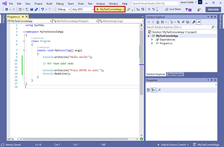

# Visual Studio Quickstart - Windows

It's now time to start writing some code.  This is a very quick overview of how to setup your work environment and run your first C# code!

A> #### Pre-release Note
A>
A> Please remember that is book covers .NET Core 3.0 and C# 8.0, both of which are in flux as of this writing.

### Install .NET Core SDK

First, head over to <https://dotnet.microsoft.com/> and download the latest version of the .NET Core SDK \(Windows, 64-bit\) for your computer.

Once it's downloaded, go to your "Downloads" folder and run the installer.  Take all of the defaults.

### Install Visual Studio 2019

Next, head over to <https://visualstudio.microsoft.com/> and download the latest version of Visual Studio 2019 _Community Edition_.  Please read the licensing differences between the different versions of Visual Studio.  Community Edition can be used for educational purposes and for open source software development.

Once it's downloaded, go to your "Downloads" folder and run the installer.  You will be presented with a host of options.  For our purposes, you will only select the ".NET Core for Cross-platform Development" workload.  You may have to scroll down to see it.

This installation will take a fair amount of time.  Once it is done, open Visual Studio 2019.  You will see the following window.

Click on "Create a new project".

We want to create a new _Console App \(.NET Core\)_.  You may have to use the search box or the dropdown in the upper right-hand corner and select "Console".

On the next screen, pick a folder on your computer in which to store your code.  We will leave the box on the screen unchecked so that it will create a sub-folder for all of the code in this sample.  You can put in anything for the project and solution names.

Click create!

Visual Studio has created a shell for our program.  In the .NET world, we create a _solution_ to hold our _projects_.  A solution simply provides us a place to group similar programs.  Each project is a separate program.  It can be a console app, a Windows GUI app, or a web app.

The solution is the top-most item in _Solution Explorer_.  Right-click the _next_ item.  This is your project.  Click on properties.  This brings up the following screen.

Make sure that the "Target Framework" is set to ".NET Core 3.0" or later. 

Click on the "Build" tab on the left-hand side.

Click on "Advanced..." in the lower right-hand corner.

Set the "Language version" to 8.0 or later.

OK out of there and close the current tab, your project properties.  This will bring you back to the main code window with a file open called "Program.cs".  This is where you will put your first code.

Put your code where it says, "PUT YOUR CODE HERE".  It should look something like this.

<<[Your First Program](cs/your-first-program.cs)

Click the following button to build \(compile\) and run your first program.  You can also hit `F5`.

You will see the following window if all went well.  This is a _console_ or _terminal_ window.  

Always be sure to include the following two lines at the end of your code.  It will prevent the console window from closing immediately after the program is done executing.

    Console.WriteLine("Press ENTER to exit.");
    Console.ReadLine();

There are many good resources for learning more about Visual Studio on the web.  Please check out those resources and videos.
